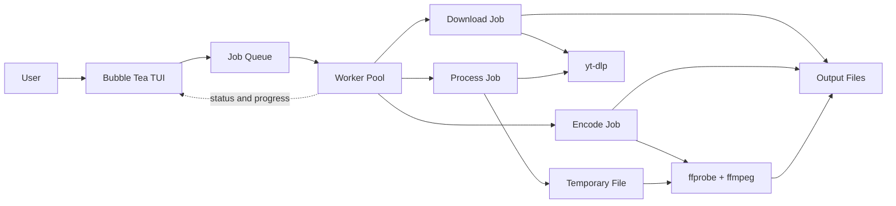

# Fornax

I came up with Fornax because I was tired of using ad-heavy YouTube-to-MP4
websites and wanted a simple tool that could do the same job locally. It is a
terminal media processing app I built while learning Go and concurrent
programming.

Fornax can download videos, convert local media files, or run both steps
together. Multiple jobs can run at the same time, with their status and
progress shown in a terminal dashboard.

## Features

- Download media from a URL with `yt-dlp`
- Convert local media files with `ffmpeg`
- Download and convert media in one job
- Process several jobs concurrently
- View job status and progress in a terminal dashboard
- Manually requeue failed jobs

## Requirements

- Go 1.25 or newer
- `yt-dlp`
- `ffmpeg` and `ffprobe`

On macOS, the external tools can be installed with Homebrew:

```bash
brew install yt-dlp ffmpeg
```

## Running Fornax

Run the project directly:

```bash
go run .
```

Or build a binary first:

```bash
go build -o fornax .
./fornax
```

Choose an action from the menu and enter the requested values. Output
directories should already exist.

### Controls

| Key | Action |
| --- | --- |
| `up` / `k` | Move up |
| `down` / `j` | Move down |
| `enter` | Select or submit |
| `m` | Return to the menu from the dashboard |
| `r` | Requeue the selected failed job |
| `q` | Quit from the menu or dashboard |
| `ctrl+c` | Quit from any screen |

## Architecture



The TUI adds jobs to a bounded queue. A pool of workers reads from that queue
and runs jobs concurrently. Each job stores its own status, progress, and error
so the dashboard can update while work is running.

## Development

```bash
go fmt ./...
go vet ./...
go test ./...
```

The project is split into small packages under `internal/`:

- `download`: runs `yt-dlp`
- `encode`: runs `ffprobe` and `ffmpeg`
- `job`: defines download, encode, and combined jobs
- `queue`: stores pending jobs
- `worker`: processes jobs concurrently
- `ui`: contains the Bubble Tea terminal interface
- `validate`: contains input validation helpers
